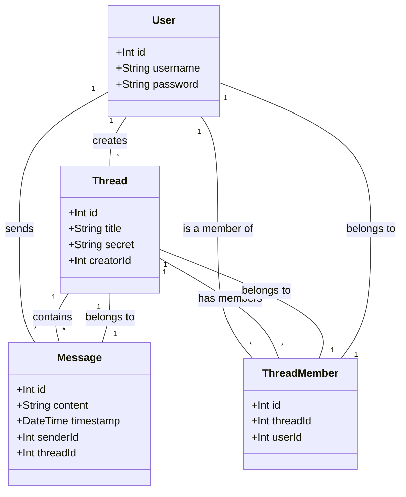

```mermaid
classDiagram
    User "1" -- "*" Thread : creates
    User "1" -- "*" Message : sends
    User "1" -- "*" ThreadMember : is a member of
    Thread "1" -- "*" Message : contains
    Thread "1" -- "*" ThreadMember : has members
    Message "1" -- "1" Thread : belongs to
    ThreadMember "1" -- "1" Thread : belongs to
    ThreadMember "1" -- "1" User : belongs to
    class User {
        +Int id
        +String username
        +String password
    }
    class Thread {
        +Int id
        +String title
        +String secret
        +Int creatorId
    }
    class ThreadMember {
        +Int id
        +Int threadId
        +Int userId
    }
    class Message {
        +Int id
        +String content
        +DateTime timestamp
        +Int senderId
        +Int threadId
    }
```
